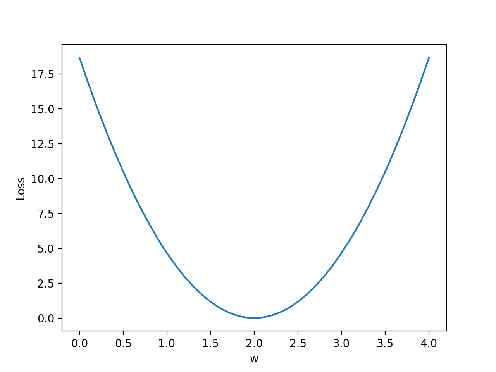

# ch1

setup
select your pip version and os
https://pytorch.org/
```
pip3 install torch torchvision

python
>>> import torch
>>> print(torch.__version__)
1.3.0
#Ctrl+D to exit

```

# ch2 liner model

```
hours,points
1,2
2,4
3,6
4,?

hy = x * w + b

loss function(MES) = (hy-y)^2 / #sample
if w ... function value
w = 0, loss = 18.7
w = 1, loss = 4.7
w = 2, loss = 0
w = 3, loss = 4.7
w = 4, loss = 18.7

so , find w make Min MES

in ch2/forward.py

1. define forward function(our model)
   y = x * w
2. define loss function
   (predict y - y) ^ 2

3. data set

x_data = [1.0, 2.0, 3.0]
y_data = [2.0, 4.0, 6.0]

x = 1, y = 2
x = 2, y = 4
x = 3, y = 6


4. random w (from 0 to 4, each step 0.1)
w = 0, loss = 18.7
w = 0.1, loss = ...
w = 1, loss = 4.7
w = 1.1, loss = ...
...

finally, get to w and loss function relation(cost graph)

```



